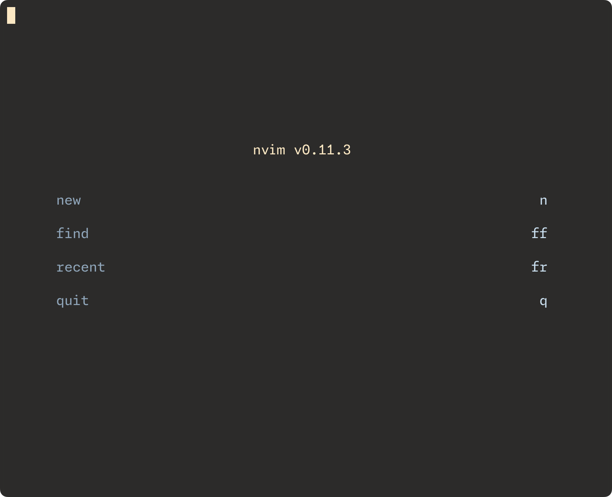
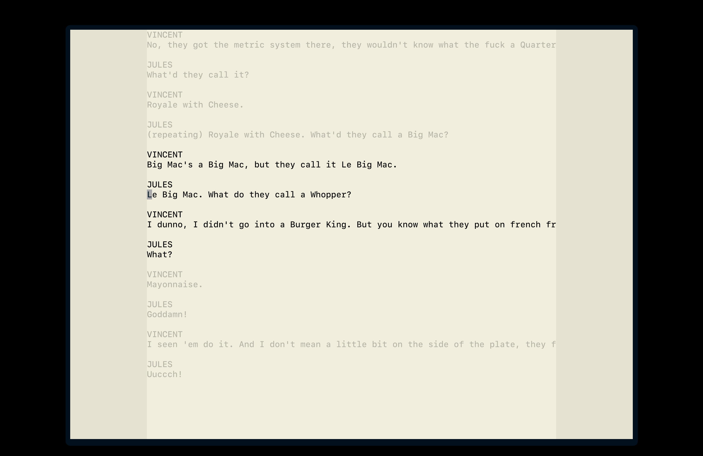

# dotfiles

### casks

[wezterm](https://github.com/wez/wezterm) - rust-based terminal emulator w/ mulitplexing & lua config

[zen](https://zen-browser.app) - web browser

[alfred](https://www.alfredapp.com/) - spotlight replacement

[appcleaner](https://freemacsoft.net/appcleaner/) - smarter app manager

[monitor control](https://github.com/MonitorControl/MonitorControl) - external monitor controller

[numi](https://numi.app/) - natural language calculator

[rectangle](https://rectangleapp.com) - window manager

[hiddenbar](https://github.com/dwarvesf/hidden) - menu bar manager

[maccy](https://maccy.app) - clipboard manager

### homebrew formulae

[lazygit](https://formulae.brew.sh/formula/lazygit)

[lsd](https://formulae.brew.sh/formula/lsd)

[neovim](https://formulae.brew.sh/formula/neovim)

[tree](https://formulae.brew.sh/formula/tree)

[zsh-syntax-highlighting](https://formulae.brew.sh/formula/zsh-syntax-highlighting)

[zsh-autosuggestions](https://formulae.brew.sh/formula/zsh-autosuggestions)

[zoxide](https://github.com/ajeetdsouza/zoxide)

[termscp](https://github.com/veeso/termscp)

[nnn](https://github.com/jarun/nnn)

### neovim

i use a custom neovim config with [lazy.nvim](https://github.com/folke/lazy.nvim) as my plugin manager
